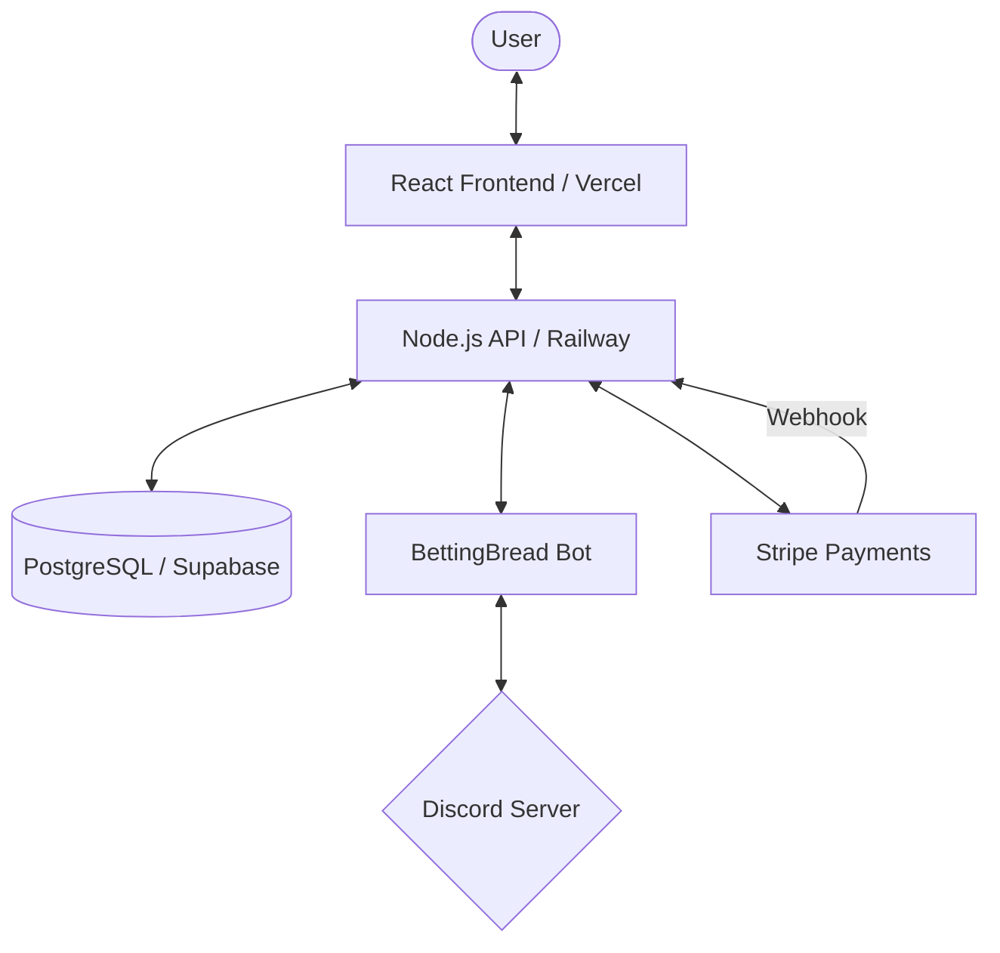

# 🍞 BettingBread | AI-Driven Betting Intelligence

Welcome to the **BettingBread** repository. This platform provides real-time betting insights, AI-powered predictions, and an exclusive Discord community for serious bettors.

## 🏗️ Architecture Overview

BettingBread is built with a modern decoupled architecture designed for high throughput and security.



## 🔄 Core Integration Flow

### 1. Authentication & Profiling
Users log in via **Discord OAuth2**. On successful authentication, the server:
- Synchronizes the Discord profile with our `profiles` table.
- Stores secure session cookies.

### 2. Payment & Membership
- Users initiate a checkout which generates a **Stripe Checkout Session**.
- Upon payment, Stripe sends a secure **Webhook** to our API.
- The Server validates the hash, creates a `transaction` record, and updates the `membership` status.

### 3. Role Automation
- Once a membership is active, the server triggers the **Discord Service**.
- The bot grants the configured **"Bread Bro"** role to the user in the target guild.
- Role hierarchy is managed automatically (Grant/Revoke/Expiry).

## 📂 Repository Structure

```text
├── client/                 # React (Vite) Frontend
│   ├── src/
│   │   ├── components/     # Reusable UI primitives & Layouts
│   │   ├── pages/         # Page-level components (Home, Dashboard, Admin)
│   │   ├── contexts/      # App-level state (Auth, Theme)
│   │   └── lib/           # Utility functions & API clients
│   └── public/            # Static assets & SEO (Sitemap/Robots)
│
├── server/                 # Node.js (Express) Backend
│   ├── routes/            # API endpoints (Auth, Payment, Dashboard)
│   ├── services/          # Business logic (Discord Bot, Cron Jobs)
│   ├── middleware/        # Security, Logging, CSRF, Rate Limiting
│   ├── db/                # Database schemas & migrations
│   └── utils/             # Config validation & Logger
```

## 🔐 Production Hardening

- **Global Rate Limiting**: Protects against DDoS with strict window limits.
- **CSRF Protection**: Implemented via `double-csrf` for all mutable API routes.
- **Graceful Shutdown**: Handles SIGTERM signals to ensure clean DB pool termination.
- **Data Integrity**: Append-only `audit_logs` track every critical user event.
- **Log Rotation**: Daily log rotation prevents disk space issues in production.

## 🚀 Deployment

### **Frontend (Vercel)**
- Connect your GitHub repository.
- Ensure `VITE_API_URL` points to your Railway backend.

### **Backend (Railway)**
- Deploy the `server` directory.
- Ensure all environment variables from `.env.example` are configured.
- The system will automatically validate the config on startup.

---

© 2026 BettingBread. Built for high-performance betting intelligence.
